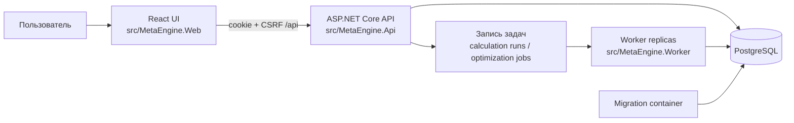
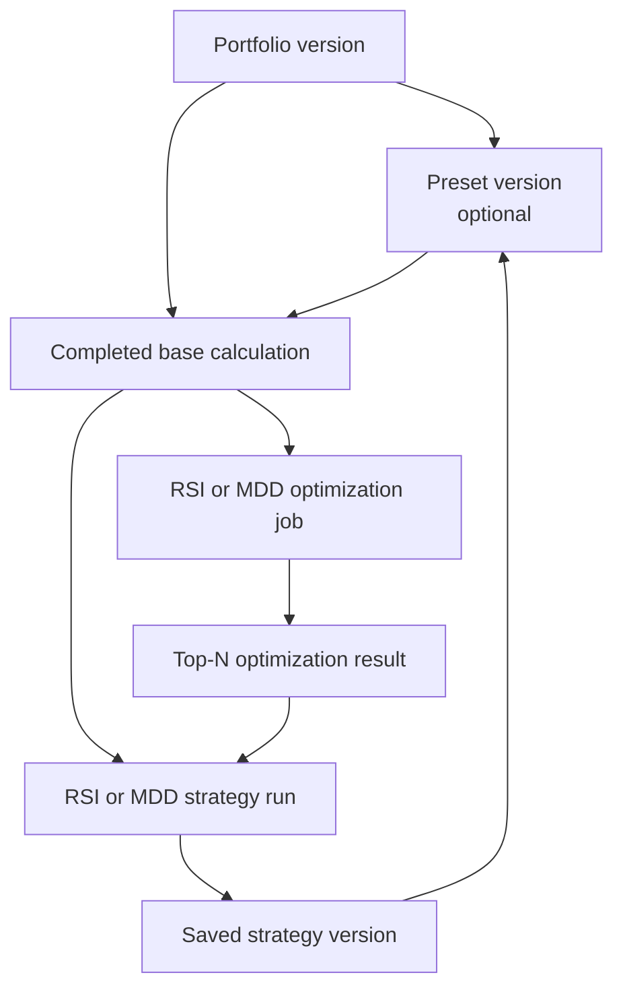

# MetaEngine architecture

Этот документ описывает фактическую архитектуру `main` на текущий момент. Он
отделяет работающую production-платформу от local lab и не является разрешением
на публичный запуск: release gaps перечислены в конце.

## Статус продукта

В репозитории намеренно существуют два контура:

| Контур | Назначение | Хранение и запуск |
| --- | --- | --- |
| Node.js local lab | Быстрая ручная проверка формул, CSV и старого интерфейса | Файлы `samples/`, `npm start`, порт `5173` |
| Production platform | Версионированные данные, асинхронные расчеты, стратегии и оптимизация | ASP.NET Core, PostgreSQL, Worker, React UI |

Production platform уже выполняет расчеты и оптимизацию RSI/MDD. Она пока не
является публичным интернет-сервисом: UI развертывается отдельно, а TLS,
reverse proxy, backups, metrics, alerts и release runbook еще не готовы.

## Компоненты

- **React UI**: вход, импорт данных, пресеты, постановка расчетов, RSI/MDD
  calculations и optimizations, просмотр результатов и сравнение рядов.
- **API**: workspace authorization, cookie authentication, CSRF, валидация
  запросов и запись неизменяемых версий и задач. API не выполняет тяжелый
  расчет внутри HTTP-запроса.
- **PostgreSQL**: пользователи, workspaces, версии портфелей и стратегий,
  пресеты, задачи, audit events и канонические результаты `timestamp,diff`.
- **Worker**: забирает base/strategy calculations и optimizer jobs из одной
  очереди. Несколько Worker безопасно работают с одной базой через lease и
  `FOR UPDATE SKIP LOCKED`.
- **Migration container**: перед запуском API/Worker применяет EF Core
  migrations. Сам API migrations не запускает.

## Данные и неизменяемость

Production принимает двухколоночный portfolio CSV с header или без него: вторая
колонка выбирается как `accum` или `diff`, при этом импорт всегда сохраняет
канонический ряд `timestamp,diff`. Импорт создает неизменяемую
`PortfolioVersion` с checksum. Результаты всех расчетов также хранят только
канонический ряд `timestamp,diff`; `accum`, HWM, DD и MDD всегда
восстанавливаются из него.

Каждая стрелка фиксирует конкретную версию источника. Более поздний импорт,
пресет или сохранение стратегии не меняют уже поставленный или завершенный
расчет.

## Расчеты и стратегии

1. Пользователь импортирует портфель или собирает пресет из портфелей и/или
   сохраненных стратегий.
2. API ставит base calculation в очередь для выбранного периода и timeframe.
3. Worker сохраняет summary и immutable artifact.
4. Для completed base calculation можно поставить RSI или MDD Mean Reversion
   strategy run либо optimization job.
5. Optimizer делит источник на последовательные samples, вычисляет кандидаты
   потоково и хранит только top-N aggregate results.
6. Выбранный optimizer result ставит обычный strategy run в очередь. После его
   завершения результат можно сохранить как новую versioned strategy и затем
   использовать в preset.

RSI и MDD используют один модульный контракт. Их параметры, outputs и
optimization controls описываются descriptor-ами; добавление следующей
стратегии не должно требовать ветвлений в общей очереди или API.

## Очередь и надежность

Calculation runs и optimization jobs имеют статусы `queued`, `running`,
`completed`, `failed`, `interrupted`; optimization также поддерживает
`stopping` и `stopped`.

При claim Worker получает lease ID и периодически обновляет heartbeat. Истекшая
lease восстанавливается, временная ошибка PostgreSQL автоматически повторяется
с ограниченной экспоненциальной задержкой, а пользователь может вручную
повторить `failed` или `interrupted` задачу. Stop для optimization завершает
текущего кандидата и сохраняет уже накопленный top-N.

## Окружение и запуск

`compose.yml` поднимает PostgreSQL, одноразовый migration container, API и
настраиваемое число Worker replicas. По умолчанию запускаются две replicas с
лимитами CPU/RAM из `.env`. Production React UI пока не входит в Compose: в
разработке Vite запускается на порту `3000` и proxy-ирует `/api` на API `5080`.

Текущий Compose-профиль пригоден для local/staging проверки. Для публичного
окружения требуется private override с Data Protection PFX, HTTPS reverse proxy
и отдельная операционная конфигурация.

## Что пока не готово для публичного production

- контейнерная поставка React UI и same-origin reverse proxy/TLS;
- backups, проверенный restore и rollback procedure;
- централизованные metrics, alerts и operational runbook;
- управление участниками workspace, password recovery, 2FA/OIDC и rate limiting;

## Подробные документы

- `docs/PRODUCTION_DATABASE.md` — схема и migrations;
- `docs/PRODUCTION_AUTH.md` — bootstrap, cookie и CSRF;
- `docs/CALCULATION_RUNS.md` — runs и artifacts;
- `docs/PRODUCTION_STRATEGIES.md` — strategy runs и saved strategies;
- `docs/PRODUCTION_OPTIMIZATION.md` — RSI/MDD optimization;
- `docs/QUEUE_RELIABILITY.md` — leases, retry и несколько Worker;
- `docs/PRODUCTION_DEPLOYMENT.md` — Compose deployment;
- `docs/PRODUCTION_UI.md` — пользовательский workflow React UI.
